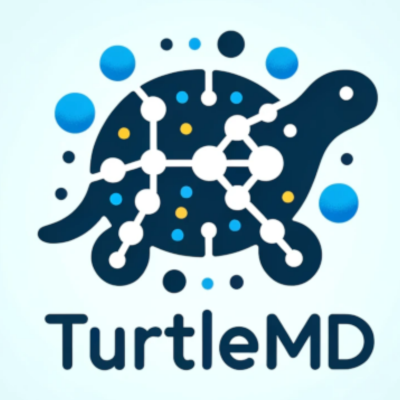

# TurtleMD

[](https://coveralls.io/github/infretis/turtlemd?branch=main)
[](https://github.com/psf/black)



TurtleMD is a slow molecular dynamics software for testing and educational purposes.

## Features

## Installation

TurtleMD can be installed via [pip](https://pypi.org/project/turtlemd/):

```bash
pip install turtlemd
```

## Contributing

If you're interested in improving TurtleMD or have ideas for new features, please feel free to fork the repository, make your changes, and submit a pull request.


## License

TurtleMD is released under the MIT License. See the [LICENSE](LICENSE) file for more details.
